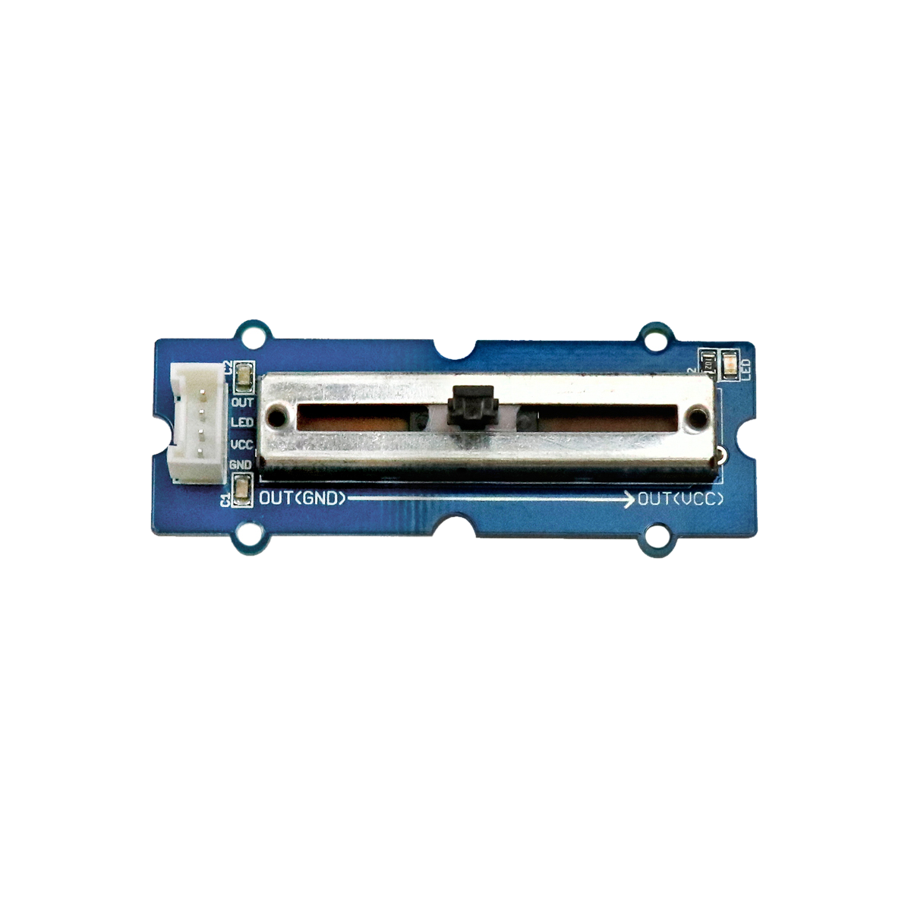

# Schiebepotentiometer

## Beschreibung
Der Schiebepotentiometer ist ein veränderbarer Widerstand. Durch Verschieben des Hebels verändert sich das Widerstandsverhältnis zwischen seinen drei Anschlüssen. Durch die bereits integrierte Verschaltung als Spannungsteiler gibt das Modul an seinem Anschluss eine analoge Spannung direkt abhängig von der Hebelposition aus. Der Sensor kann direkt oder mithilfe des Grove Shields an einen analogen Pinam Arduino angeschlossen werden.

Der Schiebepotentiometer kann vor allem als Eingabe (Schieberegler) für einen Mikrocontroller verwendet werden. Mit einem solchen Schieberegler kann beispielsweise die Helligkeit einer Leuchte oder die Geschwindigkeit eines Motors eingestellt werden.

Alle weiteren Hintergrundinformationen sowie ein Beispielaufbau und alle notwendigen Programmbibliotheken sind auf dem offiziellen Wiki (bisher nur in englischer Sprache) von Seeed Studio zusammengefasst. Zusätzlich findet man über alle gängigen Suchmaschinen durch die Eingabe der genauen Komponentenbezeichnung entsprechende Projektbeispiele und Tutorials.

## Beispiele

!!!show-examples:./examples/

<!-- infolist -->

## Wichtige Links für die ersten Schritte:

- [Seeed Studio Wiki](http://wiki.seeedstudio.com/Grove-Slide_Potentiometer/) [- Schiebepotentiometer](http://wiki.seeedstudio.com/Grove-Slide_Potentiometer/)

## Projektbeispiele:

- [Funduino Tutorials - Blinkgeschwindigkeit einer LED](https://funduino.de/nr-7-potentiometer)

## Weiterführende Hintergrundinformationen:

- [Spannungsteiler - Wikipedia Artikel](https://de.wikipedia.org/wiki/Spannungsteiler)
- [Potentiometer - Wikipedia Artikel](https://de.wikipedia.org/wiki/Potentiometer)
- [GPIO - Wikipedia Artikel](https://de.wikipedia.org/wiki/Allzweckeingabe/-ausgabe)
- [GitHub-Repository: Schiebepotentiometer](https://github.com/MakeYourSchool/23-Schiebepotentiometer)

